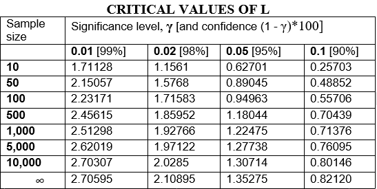

<!-- README.md is generated from README.Rmd. Please edit that file -->

# LREPUtah

<!-- badges: start -->

[](https://travis-ci.com/jiqiaingwu/LREPUtah)
[](https://github.com/jiqiaingwu/LREPUtah/actions)
<!-- badges: end -->

The goal of LREPUtah is to estimate the Parameters for the Pareto
Distribution and test Pareto vs. Exponential Distributions

## Installation

You can install the released version of LREPUtah from
[CRAN](https://CRAN.R-project.org) with:

``` r
install.packages("LREPUtah")
```

And the development version from [GitHub](https://github.com/) with:

``` r
# install.packages("devtools")
devtools::install_github("jiqiaingwu/LREPUtah")
```

## Introduction

Our test is a likelihood ratio test of the following hypotheses:

Ho: data comes from an exponential distribution, versus the alternative

H1: data comes from a Pareto distribution.

The approach is to consider the ratio of the maxima of the likelihoods
of the observed sample under the Pareto or exponential (in the
numerator) and exponential (in the denominator) models. The logarithm
(natural) of the likelihood ratio, the L statistic, is:

,%5Cunderset%7B%5Csigma%20%3E0%7D%7Bsup%7DL_%7Bexp%7D\(%5Cvec%7Bx%7D%20%7C%20%5Csigma%20\)\)%7D%7B%5Cunderset%7B%5Csigma%20%3E0%7D%7Bsup%7DL_%7Bexp%7D\(%5Cvec%7Bx%7D%7C%5Csigma%20\)%7D)

Where  is the observed
sample of excesses and )
and )
are the likelihood functions of the sample under Pareto and exponential
models, respectively.

We use a Pareto distribution with the survival function =P\(X%3Ex\)=\(%5Cfrac%7B1%7D%7B1+%5Cfrac%7Bx%7D%7Bs%5Calpha%7D%7D\)%5E%7Ba%7D)
and exponential distribution with the survival function =P\(X%3Ex\)=exp\(-%20%5Cfrac%7Bx%7D%7B%5Csigma%20%7D\)).
To compute L, both likelihoods are maximized first (via maximum
likelihood estimates, MLEs, of the parameters), and then the natural
logarithm of their ratio is taken as the likelihood ratio statistic.
Panorska et al. (2007) provide the necessary theoretical results for the
implementation of the numerical routines necessary for the computation
of L. The properties of the test, proofs and more details on the
optimization process appear separately in Kozubowski et al.(2007)

The 100)
percentiles of L provide the critical numbers for our test on the
significance level . The test is
one-sided and we reject the null hypothesis if the computed value of the
test statistic exceeds the critical number. We have computed some common
percentiles for the distribution of L under the null hypothesis for
different sample sizes and for the limiting case. The percentiles for
finite sample sizes were computed via Monte Carlo simulation with 10,000
samples of a given size from the exponential distribution (Table below).



## Example

This is a basic example which shows you how to solve a common problem:

``` r
library(LREPUtah)

###example when data is Exponential
####################################

x<-rexp(1000,0.000000000005)
1/mean(x)
#> [1] 5.104367e-12
sigmaalphaLREP(x,10^-12)
#>         s.hat     a.hat log.like.ratio
#> [1,] 21789436 0.1170949              0
expparetotest(x,0.05)
#>         s.hat     a.hat log.like.ratio
#> [1,] 21789436 0.1170949              0
#> Critical value: 2.446109 
#> Deviance statistic: 0 
#> Data is comming from an exponential distribution

##asymptotic p-value
1/2*(1-pchisq(0,df=1))
#> [1] 0.5


x<-rexp(1000,0.1)
1/mean(x)
#> [1] 0.1029218
sigmaalphaLREP(x,10^-12)
#>         s.hat    a.hat log.like.ratio
#> [1,] 228.9593 24.56182       1.442054
expparetotest(x,0.05)
#>         s.hat    a.hat log.like.ratio
#> [1,] 228.9593 24.56182       1.442054
#> Critical value: 2.446109 
#> Deviance statistic: 1.442054 
#> Data is comming from an exponential distribution

##asymptotic p-value
1/2*(1-pchisq(1.596044,df=1))
#> [1] 0.1032324


###example when data is Pareto
####################################
pareto.generation<- function(s,a,n)
{
    u<-runif(n)
    x<-s*((1-u)^(-1/a)-1)
    x
}


x<-pareto.generation(10,7,1000)
sigmaalphaLREP(x,10^-12)
#>         s.hat    a.hat log.like.ratio
#> [1,] 12.60013 8.658641       11.63293
expparetotest(x,0.05)
#>         s.hat    a.hat log.like.ratio
#> [1,] 12.60013 8.658641       11.63293
#> Critical value: 2.446109 
#> Deviance statistic: 11.63293 
#> Data is comming from Pareto distribution

##asymptotic p-value
1/2*(1-pchisq(14.43144,df=1))
#> [1] 7.267762e-05
```
